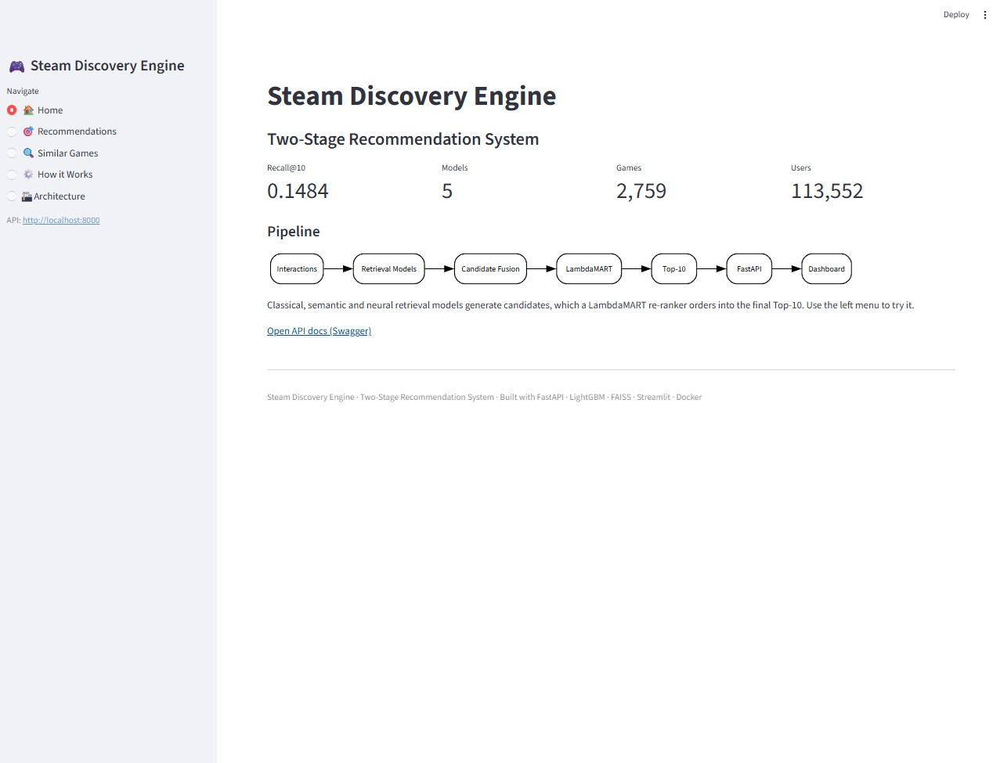
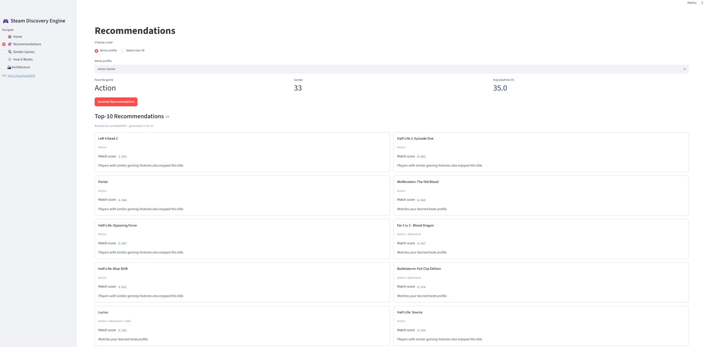
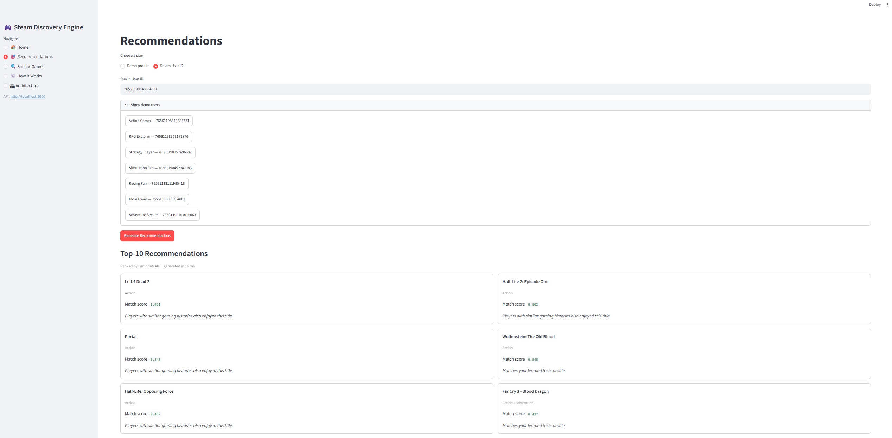
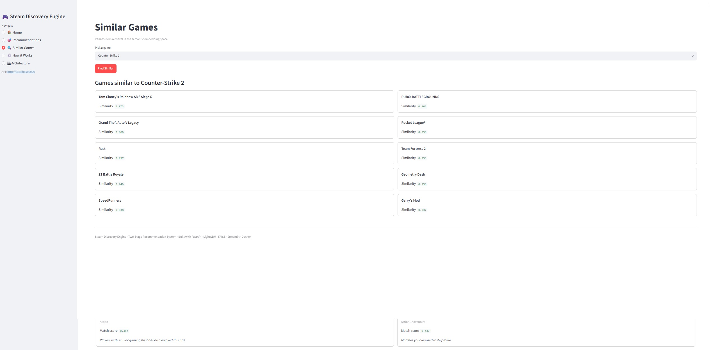
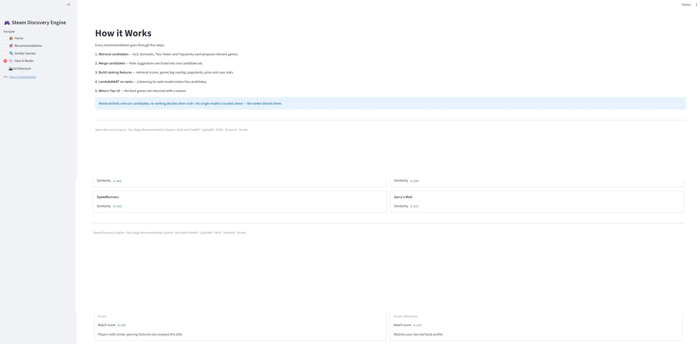

# 🎮 Steam Discovery Engine

> **A production-style recommendation system built from scratch, evolving from classical collaborative filtering to a complete two-stage retrieval and ranking pipeline.**

<p align="center">
  
</p>

<p align="center">
<b>Research • Machine Learning • Recommendation Systems • FastAPI • Docker • Streamlit</b>
</p>

---

# Project Overview

Steam Discovery Engine is an end-to-end recommendation system designed to demonstrate how modern recommendation systems are built in practice.

Instead of training a single model, the project follows the same evolution used in production systems:

* start with simple baselines;
* improve candidate retrieval;
* learn semantic item representations from text;
* train neural user and item embeddings;
* combine multiple retrieval models;
* re-rank candidates using Learning-to-Rank;
* expose the final pipeline through a REST API;
* package everything with Docker and an interactive dashboard.

Every stage is evaluated under the same temporal validation protocol, making performance improvements directly comparable.

---

# Dashboard

<p align="center">

</p>

The project includes a Streamlit dashboard that allows users to:

* browse demo player profiles;
* generate personalized recommendations;
* explore similar games;
* inspect the recommendation architecture.

---

# Recommendation Pipeline

The project follows a production-style two-stage recommendation architecture.

```text
User Interactions
        │
        ▼
Retrieval Models
(Popularity / ALS /
 Semantic / Two-Tower)
        │
        ▼
Candidate Fusion
        │
        ▼
Feature Engineering
        │
        ▼
LambdaMART Re-ranking
        │
        ▼
Top-10 Recommendations
        │
        ▼
FastAPI Service
        │
        ▼
Streamlit Dashboard
```

Unlike toy recommendation projects, the ranking model never searches the entire catalog.

Instead:

1. multiple retrieval models generate candidates;
2. candidates are merged;
3. feature engineering describes every user–game pair;
4. LambdaMART produces the final ordering.

This architecture closely follows industrial recommendation systems.

---

# Research Journey

The project is organized as a sequence of research notebooks.

| Notebook  | Topic                                              |
| --------- | -------------------------------------------------- |
| 01        | Exploratory Data Analysis                          |
| 02        | Data Validation & Evaluation Protocol              |
| 03        | Classical Retrieval (Popularity, Content-Based, ALS) |
| 04        | Semantic Retrieval using Sentence Transformers     |
| 05        | Neural Retrieval (Two-Tower Network)               |
| 06        | Learning-to-Rank (LambdaMART)                      |
| API       | FastAPI inference service                          |
| Dashboard | Streamlit web application                          |

Rather than comparing unrelated models, every notebook extends the previous stage and improves the recommendation pipeline.

---

# Model Evolution

```text
Popularity
      │
      ▼
ALS Collaborative Filtering
      │
      ▼
Content-Based Retrieval
      │
      ▼
Semantic Retrieval
      │
      ▼
Neural Retrieval
      │
      ▼
Candidate Fusion
      │
      ▼
LambdaMART Re-ranking
      │
      ▼
Production API
```

---

# Final Results

Every model was evaluated using the same temporal **leave-last-out** protocol.

| Stage               | Model                  |  Recall@10 |     MAP@10 |    NDCG@10 |
| ------------------- | ---------------------- | ---------: | ---------: | ---------: |
| Baseline            | Popularity             |     0.1224 |     0.0407 |     0.0595 |
| Classical Retrieval | ALS                    |     0.1343 | **0.0594** |     0.0769 |
| Semantic Retrieval  | Semantic Embedding     |     0.0728 |     0.0285 |     0.0388 |
| Neural Retrieval    | Two-Tower              |     0.0699 |     0.0269 |     0.0369 |
| ⭐ Two-Stage         | Retrieval + Re-ranking | **0.1484** |     0.0574 | **0.0784** |

The two-stage recommendation pipeline achieved the highest Recall@10 and NDCG@10, outperforming the strongest standalone retrieval model (ALS).

---

# Interactive Dashboard

### Home

<p align="center">

</p>

---

### Personalized Recommendations

<p align="center">

</p>

---

### Similar Games

<p align="center">

</p>

---

### Recommendation Pipeline

<p align="center">

</p>

---

### System Architecture

<p align="center">

</p>

---

# Repository Structure

```text
steam-discovery-engine/

├── notebooks/
│   ├── 01_eda.ipynb
│   ├── 02_data_validation.ipynb
│   ├── 03_baselines.ipynb
│   ├── 04_embeddings.ipynb
│   ├── 05_two_tower.ipynb
│   └── 06_ranking.ipynb
│
├── src/
│   ├── baselines/
│   ├── embeddings/
│   ├── evaluation/
│   ├── features/
│   ├── ranking/
│   ├── retrieval/
│   └── api/
│
├── dashboard/
│
├── models/
│
├── data/
│
├── docs/
│
├── export_models.py
├── build_demo.py
├── requirements.txt
├── requirements-api.txt
├── requirements-dashboard.txt
├── Dockerfile
├── docker-compose.yml
└── README.md
```

---

# Technology Stack

### Machine Learning

* Python
* NumPy
* Pandas
* Scikit-learn
* PyTorch
* LightGBM
* FAISS
* Implicit
* Sentence Transformers

### Backend

* FastAPI
* Pydantic
* Uvicorn

### Frontend

* Streamlit

### Deployment

* Docker
* Docker Compose

---

# Running the Project

Clone the repository

```bash
git clone https://github.com/MaksymChunikhin/steam-discovery-engine.git
cd steam-discovery-engine
```

### 1. Offline training & artifact export

Models and demo data are produced offline and are not stored in the repository.
Generate them once (this trains the retrieval models and the LambdaMART re-ranker
and writes everything to `models/` and `data/demo/`):

```bash
pip install -r requirements.txt
python export_models.py     # train + export artifacts to models/
python build_demo.py        # generate demo users and featured games
```

### 2. Run with Docker (inference only)

The container ships only the serving stack (no training dependencies):

```bash
docker compose build
docker compose up
```

Open

```text
API
http://localhost:8000/docs

Dashboard
http://localhost:8501
```

### Run without Docker

```bash
uvicorn src.api.app:app --host 0.0.0.0 --port 8000     # API
streamlit run dashboard/app.py                          # Dashboard
```

---

# REST API

| Endpoint                 | Description                   |
| ------------------------ | ----------------------------- |
| GET /                    | Service information           |
| GET /health              | Health check                  |
| GET /demo                | Demo users and featured games |
| GET /recommend/{user_id} | Personalized recommendations  |
| GET /similar/{game_id}   | Similar games                 |
| GET /game/{game_id}      | Game metadata                 |

---

# Key Engineering Decisions

* Unified evaluation protocol for every model.
* Temporal leave-last-out validation.
* Leakage-free ranking dataset (out-of-sample retrieval features).
* Candidate fusion from multiple retrieval models.
* Modular feature engineering (`FEATURE_BUILDERS` registry).
* Offline training and artifact export.
* Lightweight, training-free inference service.
* Dockerized deployment.

---

# Limitations

* Small public dataset (~2.8k games).
* Sparse interaction history (~6 interactions per user).
* Static data snapshot.
* Two-Tower uses user features instead of learned user ID embeddings.

---

# Future Work

* User ID embeddings.
* Larger interaction datasets.
* Session-aware recommendations.
* Online learning.
* Approximate nearest neighbor retrieval for large catalogs.
* Monitoring and model versioning.

---

# Author

**Maksym Chunikhin**

Data Scientist

GitHub: https://github.com/MaksymChunikhin

---

# License

This project is released under the MIT License.
